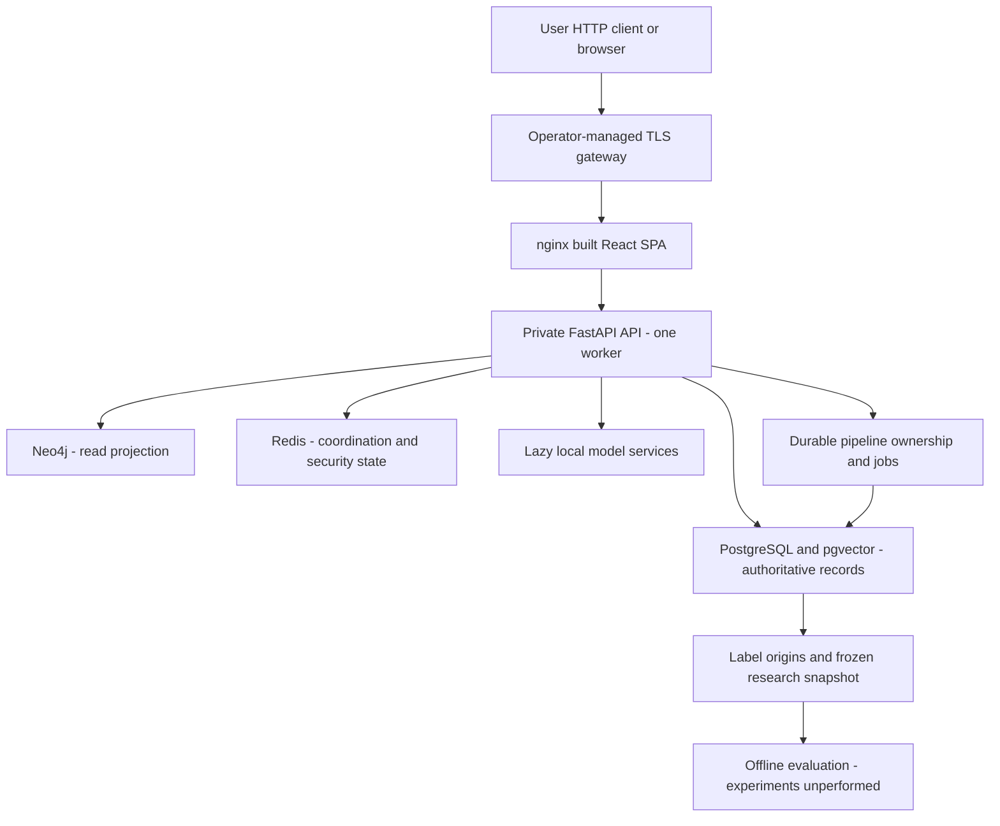

# Architecture Guide

The canonical system walkthrough is [root ARCHITECTURE.md](../ARCHITECTURE.md).
This guide summarizes deployment boundaries and cross-links the detailed
contracts; it is no longer an empty architecture scaffold.

The frontend joins only the known proxy network; datastores join a separate
internal network and have no production host ports. A dev override exposes
loopback only. Migration-first startup and health/readiness checks precede use;
model initialization belongs to the app's lazy feature path, not Docker boot.
Read-only public views, authenticated scientific tools and admin-only triggers/
exports/recovery/metrics are distinct trust boundaries.

## Why the stores are separate

PostgreSQL retains source text, claims, embeddings, typed relationships, audit,
annotation provenance and durable jobs. Neo4j supports bounded graph traversal
and may lag relational commits; its edges are inferred relationships, not causal
observations. Redis is transient coordination/security state, not the scientific
system of record. Loss/recovery of each store needs an explicit tested policy.

## Scientific and product boundaries

- Semantic proximity retrieves candidates but does not establish common event,
  support, copied content or causal propagation.
- Corpus-local checking exposes citations/passages/stance and insufficient
  coverage; it is not a web fact checker or an absolute true/false verdict.
- Typed comparison explains text/spans; temporal metadata must be supplied or
  reported unknown. Legacy graph evidence remains legacy until reanalyzed.
- Human labels require authenticated server identity, independent review and
  origin-aware consensus; automatic/legacy/test votes are not human gold.
- Event-disjoint frozen exports make evaluation auditable; creating a harness
  is not performing the experiment or establishing novelty.

## Detailed references

- [API contracts](API.md): auth, evidence, typed comparison, eval and admin controls
- [Operations](OPERATIONS.md): Compose modes, proxy trust, migrations, backup/restore
- [Dataset](DATASET.md): schema/provenance, historical counts and licensing
- [Evaluation](EVALUATION.md): annotation and exploratory artifact interpretation
- [Research](RESEARCH.md): hypotheses, baselines, ablations, splits and results ledger
- [Limitations](LIMITATIONS.md): failure modes and unmeasured resource assumptions
- [Audit](AUDIT.md): phased findings and engineering/product/research acceptance
